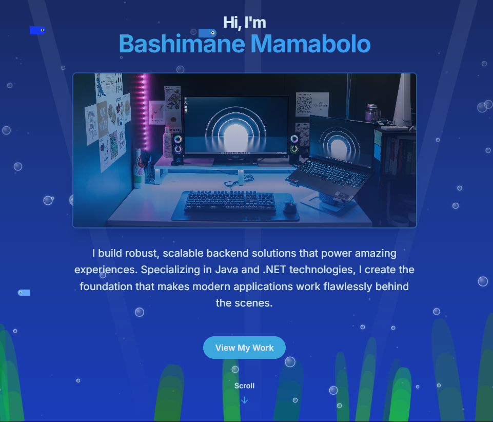

# Bashimane Mamabolo - Backend Developer Portfolio

<div align="center">
  <br />
  <a href="#" target="_blank">
    
  </a>
  <br />
  <div>
    
    
    
  </div>
  <h3 align="center">Backend Developer specializing in Java, C#, and .NET technologies</h3>
  <br />
</div>

## 📋 About This Portfolio

Welcome to my professional portfolio website showcasing my skills and experience as a Backend Developer. This portfolio is built with modern web technologies while focusing on highlighting my backend development expertise.

## 📋 Table of Contents

- [Bashimane Mamabolo - Backend Developer Portfolio](#bashimane-mamabolo---backend-developer-portfolio)
  - [📋 About This Portfolio](#-about-this-portfolio)
  - [📋 Table of Contents](#-table-of-contents)
  - [🚀 Introduction](#-introduction)
  - [⚙️ Tech Stack](#️-tech-stack)
  - [⚡️ Portfolio Features](#️-portfolio-features)
  - [👌 Running This Portfolio Locally](#-running-this-portfolio-locally)
    - [Prerequisites](#prerequisites)
    - [Installation Steps](#installation-steps)
  - [☁️ Deployment](#️-deployment)
  - [🔗 Resources \& Technologies](#-resources--technologies)

---

## 🚀 Introduction

Welcome to my professional portfolio showcasing my expertise as a Backend Developer with proficiency in Java, C#, .NET, and various database technologies. This portfolio highlights my technical skills, significant projects, and professional experience in building robust backend solutions across different domains. I'm passionate about clean code, scalable architectures, and leveraging modern technologies to solve complex problems.

---

## ⚙️ Tech Stack

* **Backend Technologies:**
  * Java, C#, SpringBoot, .NET Core
  * SQL Server, PostgreSQL, MongoDB
  * TDD, Docker, Microsoft Azure

* **Web Development:**
  * React, JavaScript, TypeScript
  * Tailwind CSS, Vite
  * Responsive Design

---

## ⚡️ Portfolio Features

* 🌑 **Light/Dark Mode Toggle**
  Seamless theme switching with smooth transitions

* 📱 **Fully Responsive Design**
  Optimized for all devices and screen sizes

* 👨‍💻 **Professional Biography**
  Overview of my background and expertise

* 📊 **Skills Showcase**
  Interactive display of technical and professional skills

* 🚀 **Project Gallery**
  Highlights of my most significant work

* 📩 **Professional Contact**
  Easy ways to get in touch for opportunities

---

## 👌 Running This Portfolio Locally

### Prerequisites

* [Node.js](https://nodejs.org/)
* [Git](https://git-scm.com/)

### Installation Steps

```bash
# Clone the repository
git clone https://github.com/Bashimane-Mamabolo/portfolio.git

# Navigate to the project directory
cd portfolio

# Install dependencies
npm install

# Start the development server
npm run dev
```

Your portfolio will be available at: [http://localhost:5173](http://localhost:5173)


## ☁️ Deployment

This portfolio is deployed using Vercel for seamless, continuous deployment. Any changes pushed to the main branch are automatically deployed to the live site.

---

## 🔗 Resources & Technologies

* [React Documentation](https://reactjs.org/)
* [Tailwind CSS Docs](https://tailwindcss.com/)
* [Java Documentation](https://docs.oracle.com/en/java/)
* [.NET Documentation](https://docs.microsoft.com/en-us/dotnet/)
* [Microsoft Azure](https://docs.microsoft.com/en-us/azure/)

---

Thank you for visiting my portfolio! I'm always open to new opportunities and collaborations.
